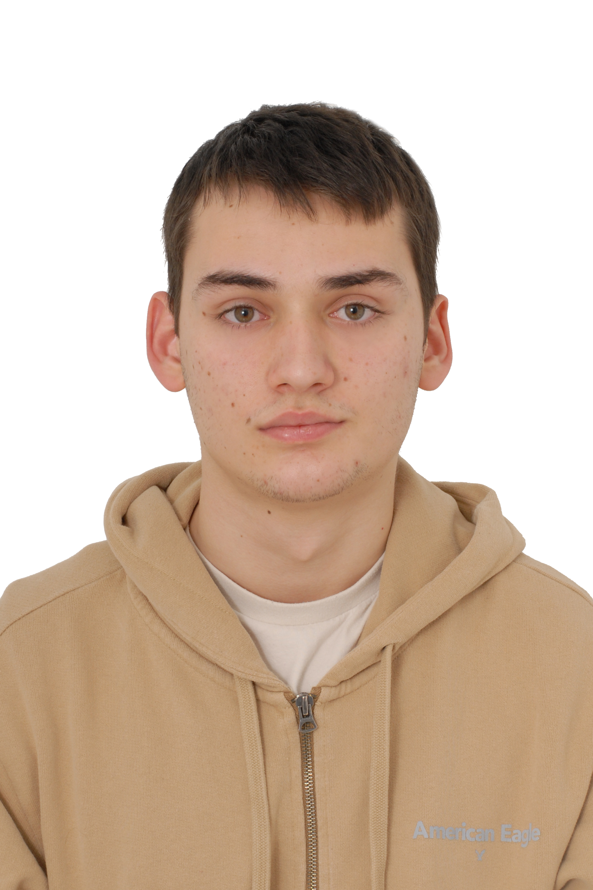

> > # Starting template

This README will need to contain a description of your project, how to run it, how to set up the development environment, and who worked on it.
This information can be added throughout the course, except for the names of the group members.
Add your own name (do not add the names for others!) to the section below.

## Description of project

## Group members

| Profile Picture | Name | Email |
|---|---|---|
|  | Franciszek Latała | F.J.Latala@student.tudelft.nl |
|  | Bart Coster | B.i.coster@student.tudelft.nl |
|  | Tiberiu Sabău | T.Sabau@student.tudelft.nl |
|  | Stavros Alexandros Dimakos | S.A.Dimakos@student.tudelft.nl |
|  | Elena Uleia | E.Uleia@student.tudelft.nl |

<!-- Instructions (remove once assignment has been completed -->
<!-- - Add (only!) your own name to the table above (use Markdown formatting) -->
<!-- - Mention your *student* email address -->
<!-- - Preferably add a recognizable photo, otherwise add your GitLab photo -->
<!-- - (please make sure the photos have the same size) --> 

## How to run it
- Clone the repository-template from gitLab
- Download the activity bank from gitLab
- Create a new folder called "activity_bank" on "repository-template/server"
- Extract all the files from step 2 inside the new folder from step 3
- Open a terminal and run the command "cd " followed by the path to the repository-template
- Run the command "gradlew bootrun"
- Open a new terminal, repeat step 3 and run the command  "gradlew run"
- You can play on you server or on a friends' server by typing the name and click on "try server"
- Type you nickname press "ENTER"
- Enjoy your game!

## How to contribute to it
- Open the repository template on any IDE of your choice
- You can find all the folders for the client and the server there
- Enjoy your time developing!
